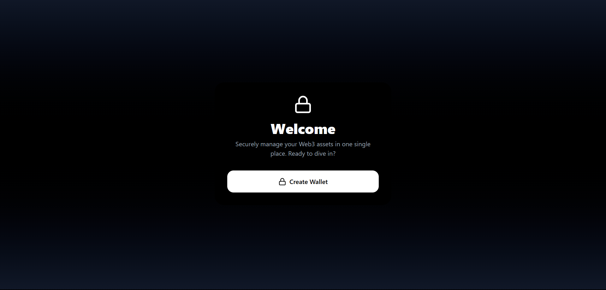
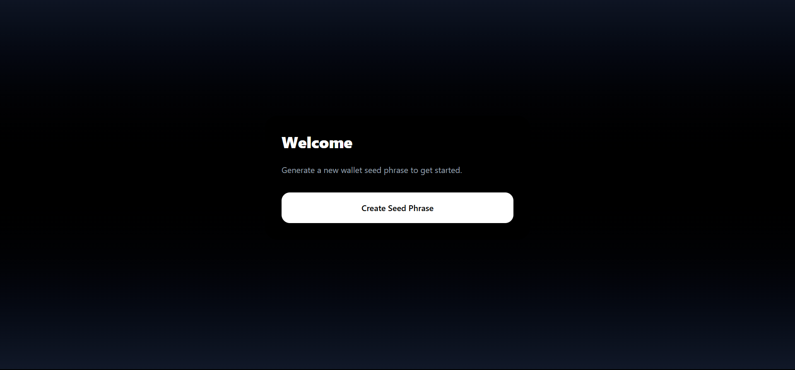
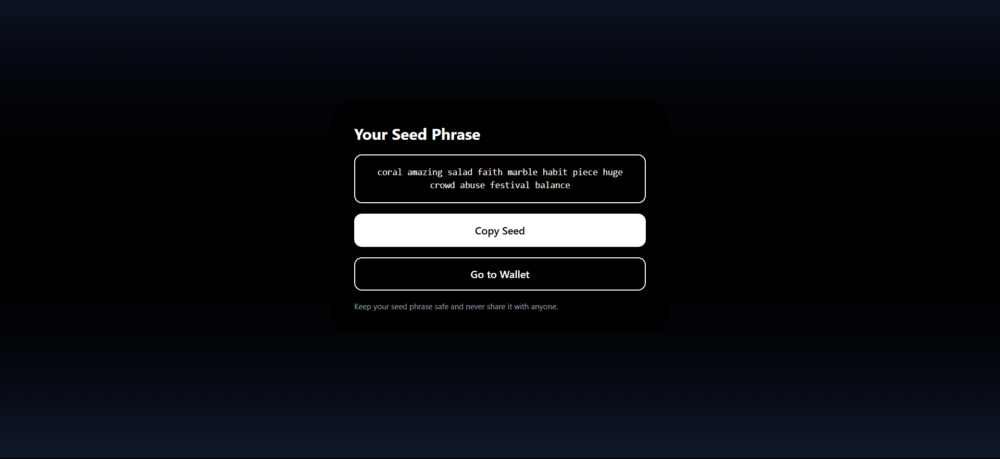
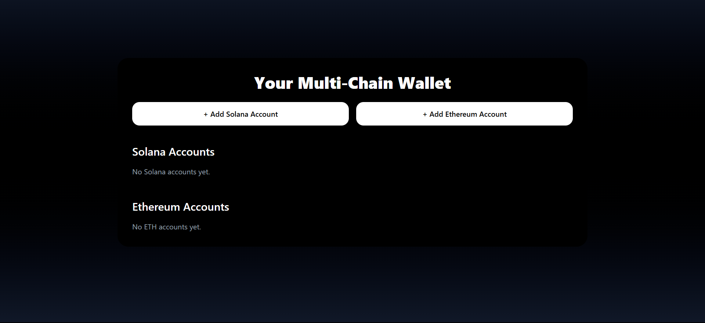
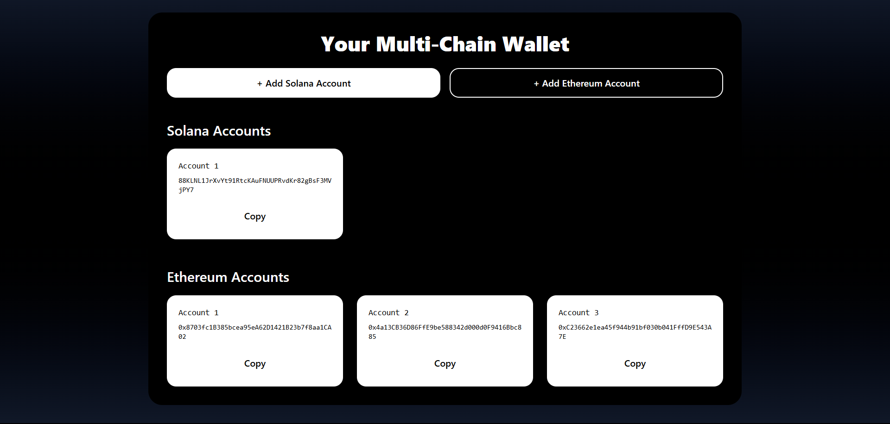

# Web Based Wallet

A modern, web3-inspired wallet app built with React, TypeScript, Vite, and Tailwind CSS. Generate secure wallet seed phrases and connect to your preferred blockchain.

## Screenshots


*Welcome screen with blockchain selection*



*Secure seed phrase generation with mnemonic word display*



*Account creation and wallet address display*

## Getting Started

1. Install dependencies:
   ```bash
   npm install
   # or
   bun install
   ```
2. Run the development server:
   ```bash
   npm run dev
   # or
   bun run dev
   ```
3. Open your browser:
   Visit [http://localhost:5173](http://localhost:5173) to use the app.

> **Security Note:** This project is for educational/demo purposes. Do not use generated seed phrases for real funds.
